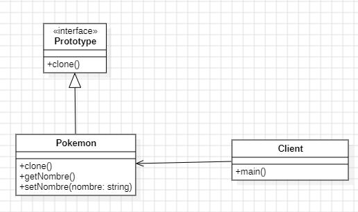

# Prototype
   
Prototype es un patron de diseño creacional que nos permite copiar objetos existentes sin que el codigo dependa de sus clases.

Es útil cuando se necesita crear nuevas instancias de objetos que son muy similares o iguales a instancias existentes y cuando el proceso de creación de dichos objetos es costoso o complicado. Este patrón permite clonar objetos en lugar de crearlos desde cero, lo que puede mejorar el rendimiento y simplificar el código en situaciones específicas.

### ¿Por qué usar el patrón prototype?

- Creación costosa: Si la creación de un objeto es costosa en términos de tiempo o recursos (por ejemplo, debido a configuraciones complejas o cálculos intensivos), el patrón Prototype permite clonar el objeto para evitar repetir el proceso de creación desde cero.

- Variaciónes de configuración: Si se necesita crear múltiples instancias de objetos con configuraciones similares o que solo difieren ligeramente, el patrón Prototype permite clonar y luego modificar las copias según sea necesario.

- Independencia de la clase concreta: Permite crear copias de objetos sin depender de la clase concreta de estos, lo que mejora la flexibilidad y reduce el acoplamiento.

- Evitar constructores complejos: Si un objeto tiene un constructor complejo o una jerarquía de clases, el patrón Prototype facilita la creación de nuevos objetos simplemente clonando una instancia existente en lugar de usar constructores.

Un ejemplo típico de uso del patrón Prototype es en programas gráficos o videojuegos, donde se crean múltiples instancias de personajes, objetos, o escenarios con configuraciones similares, pero personalizadas para cada instancia.

